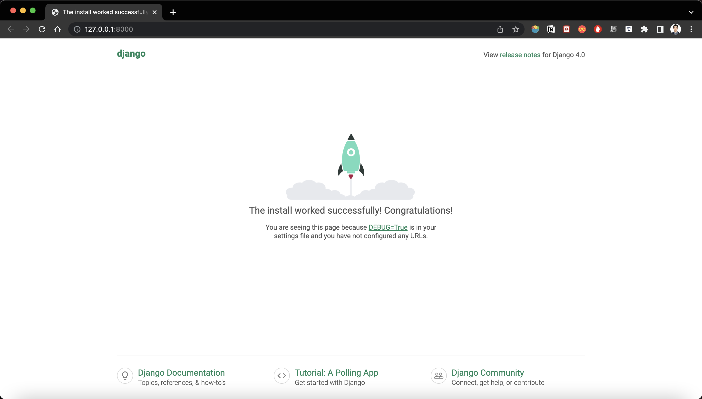

# About
This is my Django learning journal for my summer project Dublin Bus, also for future usage, we use django as the web framework.
I followed this Youtube crash course: https://www.youtube.com/watch?v=rHux0gMZ3Eg

# What is Django?
Django is a free and open source web framework with python

# Django features
- The admin site
- Object-relational mapper (ORM)
- Authentication
- caching

# Some commands
```mkdir firstDjango ```   
//will create a directory

```cd firstDjango```  
//go to the dir  

```pipenv install django```   
//install django virtual env in this folder, you will see some files for the virtual env contains 'bin', 'lib' etc.  

```pipenv shell```    
//will activate the virtual env for the project  

```django-admin```     
//will show you all the commands you can use with django  

```django-admin startproject {project name} .```    
//This will create all the core files under the folder for the application without redundant folder    

```python manage.py runserver {port number}```    
//run django server on a specified port    
  

```pipenv --venv```    
//will show you where the virtual env is  

```python manage.py startapp {app name}```    
//will create an app under the project with core files in it, and we need to add the name of the app to settings.py -> INSTALLED_APPS

# Writing views
## What is views in django?
- request -> response
- request handler
- action from the web server
## How to edit views?
Go to {app name} -> views.py  
```
from django.http import HttpResponse

def hello(request):
    return HttpResponse('Hello World')
```
# Map the view into url
## Create a urls.py in the app folder
Go to the application folder, add a new file called 'urls.py', write these codes:  
```
from django.urls import URLPattern, path
from . import views 
urlpatterns = [
    path('hello/', views.hello)
]
```
## Config 'urls.py' file under project folder
Go to 'urls.py' file under project folder
```
from django.urls import path, include  
urlpatterns = [  
    path('admin/', admin.site.urls),  
    path('{app name}/', include('{app name}.urls'))
]
```

# Templates in Django
## Directory for templates
- create  a new directory named 'templates', and create a simple html file in it
- go to views.py, change return content to this:  
```
return render(request, 'hello.html')
return render(request, 'hello.html', {'name': 'Clarence'})
```
